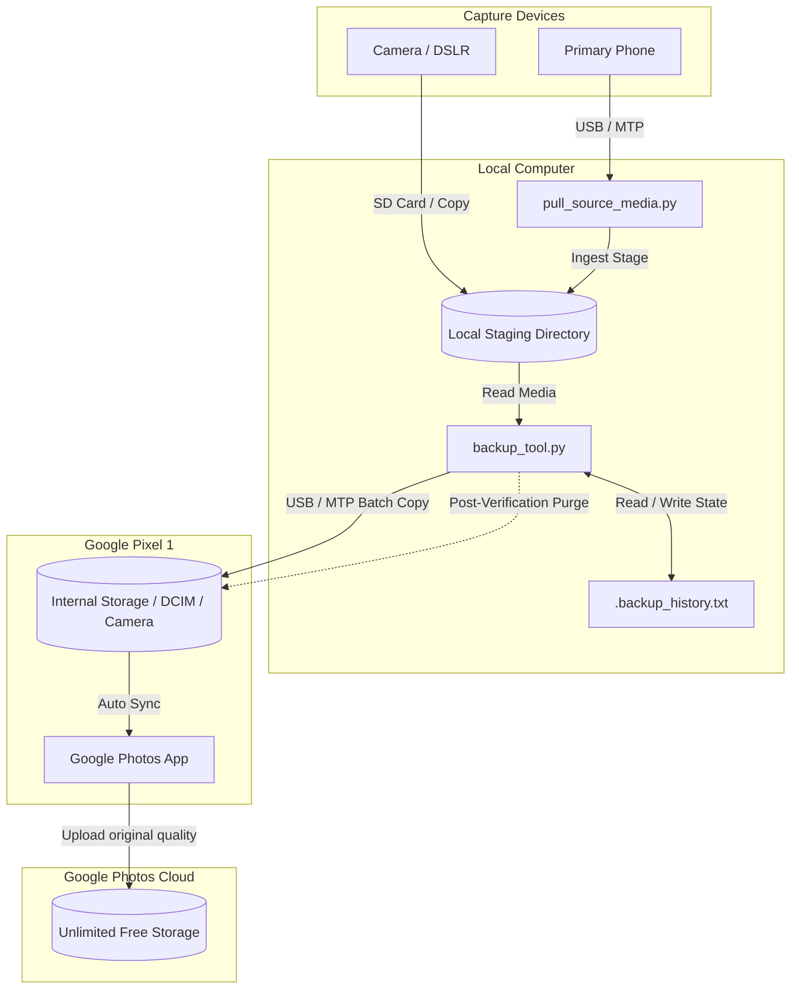

# Pixel Photo Backup Tool Architecture

This document provides a comprehensive overview of the design, system architecture, data flow, and components of the **Pixel Photo Backup Tool**.

---

## 1. Executive Summary & Strategy

The **Pixel Photo Backup Tool** is a workflow automation and synchronization system designed to archive photos and videos to Google Photos at **Original Quality** with **unlimited free storage**. 

### The Google Pixel 1 Proxy Strategy
The first-generation Google Pixel (released in 2016) is uniquely grandfathered into a lifetime program offering unlimited backup of photos and videos at Original Quality without counting against the user's Google Drive/One quota. 
This project leverages that policy by utilizing the Pixel device as an upload proxy:
1. Media is pulled from primary capture devices (e.g., DSLR, modern smartphones) onto a local staging machine.
2. The staging machine streams media files in managed batches to the Pixel device over USB/MTP.
3. The Pixel device runs the official Google Photos application, uploading files to the cloud.
4. Once verified, files are deleted from the Pixel to make room for subsequent batches.

---

## 2. Technical Challenges & Solutions

Direct transfer of large media libraries to mobile devices over USB presents two primary issues:

| Challenge | Impact | Mitigation Strategy |
| :--- | :--- | :--- |
| **Storage Exhaustion** | The Pixel 1 typically has 32GB of storage. Staging libraries often exceed 500GB, resulting in immediate write failure. | **Sequential Size-Bounded Batching**: Media is split into logical virtual batches capped at a configured size (e.g., 2000 MB). |
| **MTP Instability** | Linux GVFS/MTP protocol layers regularly crash or hang under long-running continuous transfers of thousands of small files. | **Interactive Throttling**: The tool pauses and requests confirmation after copying each batch, allowing MTP buffers to settle and Google Photos to complete uploads. |
| **Interruption & Crashes** | USB disconnects, battery drainage, or manual cancels lose transfer state. | **State History Log**: A local transaction log (`.backup_history.txt`) records successfully confirmed files, permitting safe resume behavior. |

---

## 3. Component Walkthrough

The project is structured as a two-stage CLI toolset written in standard Python, requiring no external packages outside the Python Standard Library.

### A. Stage 1: Media Ingestion (`pull_source_media.py`)
This script automates fetching photos and videos from a primary user device (e.g., a primary smartphone connected via USB) onto the local computer staging folder.

- **MTP Auto-Detection**: Scans `/run/user/<uid>/gvfs/mtp:host=*` to find the source phone, filtering out the target Pixel device by serial/model matching (`Google_Pixel_MB8090303718`).
- **Source Paths Mapping**: Pulls from default Android paths:
  - `DCIM/Camera` $\rightarrow$ `DCIM_Camera/`
  - `WhatsApp Images` $\rightarrow$ `WhatsApp_Images/`
  - `WhatsApp Video` $\rightarrow$ `WhatsApp_Video/`
- **Idempotent Copying**: Compares file sizes between source and local destination. Matches are skipped to allow fast resumes if connection drops.
- **Transfer Stability**: Uses `shutil.copyfile` (raw data copy) instead of `shutil.copy2` (which copies metadata) because MTP mounts frequently fail when attempting to write metadata or system permission attributes.

### B. Stage 2: Backup Orchestration (`backup_tool.py`)
This script orchestrates the transfers from the local staging folder to the Pixel, managing the batch limits and cleanups.

- **Dynamic Mount Discovery**: Auto-detects the connected Pixel mount path using glob search pattern `/run/user/<uid>/gvfs/mtp:host=Google_Pixel_*` pointing to `Internal shared storage/DCIM/Camera`.
- **Target Directories Clearing**: Before copying a batch, it cleans the Pixel's camera folder (`shutil.rmtree`/`os.remove`) to guarantee maximum available storage space.
- **Verification Loop**: Prompts the user with a CLI prompt to confirm cloud upload (`(yes/no)`) before deleting files from the Pixel and proceeding to the next batch.

---

## 4. Batching & Partitioning Logic

The tool processes the source root directory using one of two batching scenarios depending on the layout of `SRC_DIR`:

### Scenario A: Physical Subdirectory Partitioning
Used when the source staging folder contains nested directories (e.g., sorted by date or event like `2026-01-01_NewYears/`, `2026-02-14_Valentines/`).

1. The script lists and sorts all subdirectories in alphabetical order.
2. For each subdirectory:
   - Filter out files already listed in the history log.
   - If the remaining files exceed the configured `BATCH_SIZE_MB`, the subdirectory's files are split into virtual sub-batches (e.g., `Batch 1 of 3`).
   - The script copies the sub-batch, prompts for confirmation, logs history, and deletes the files from the Pixel before continuing.

### Scenario B: Flat Directory Partitioning
Used when the source staging directory contains a flat structure with files directly in the root folder.

1. The script gathers all files directly under `SRC_DIR` and filters out previously backed-up files.
2. The remaining files are sorted and split into virtual batches. Each batch contains a set of files whose cumulative size does not exceed `BATCH_SIZE_MB`.
3. Each batch is processed sequentially with interactive user confirmation checkpoints.

---

## 5. State Management & Resiliency

Resiliency is driven by `.backup_history.txt` located in the root of the source directory (`SRC_DIR`).

> [!IMPORTANT]
> The history log records **relative file paths** (relative to the source root directory). This preserves the integrity of the history log even if the source staging folder is moved to a different absolute path on the host computer.

### The Lifecycle of a Batch
1. **Clear Destination**: Purge the Pixel `DCIM/Camera` directory.
2. **Transfer**: Copy the active batch files to the Pixel.
3. **Wait for Upload**: User verifies that Google Photos has finished uploading (via the Google Photos app on the Pixel).
4. **Approve**: User inputs `yes` (or `y`) to the prompt.
5. **Commit State**: The relative paths of the batch's files are appended to `.backup_history.txt`.
6. **Prune**: The next iteration begins by clearing the Pixel destination.

### Interruption Recovery
If the process fails (e.g., MTP mount disconnects) or is aborted:
- The user re-runs `./backup_tool.py`.
- The tool reads `.backup_history.txt` into a memory set.
- All files matching the history set are skipped.
- Transfer resumes exactly at the uncommitted batch.

To bypass history and start a complete re-transfer, the `--reset-history` flag is provided to delete the `.backup_history.txt` file.

---

## 6. Configuration Schema

System paths and variables are configured via an `.env` file in the project root:

| Environment Variable | CLI Argument Override | Default Value | Description |
| :--- | :--- | :--- | :--- |
| `SRC_DIR` | `--src` | *Required* | Absolute path to the local staging directory containing photos to backup. |
| `BACKUP_PIXEL_CAMERA_DIR` | `--dest` | *Auto-detected* | Custom mount point for the Pixel `DCIM/Camera` directory (optional). |
| `BATCH_SIZE_MB` | `--batch-size-mb` | `2000` | The size threshold in Megabytes used to split transfers into virtual batches. |
| `LOCAL_STAGE_DIR` | `--dest` (Stage 1) | `SRC_DIR` value | Path to local staging directory where Stage 1 pulls source phone media. |
| `SOURCE_PHONE_DIR` | `--source-device` | *Auto-detected* | Custom mount point of the source primary phone (optional). |

---

## 7. Testing Strategy

Unit testing is implemented in `test_backup_tool.py` using Python's standard `unittest` library and standard mocking utilities (`unittest.mock.patch`):

- **Virtual Batching Verification**: Validates the size-partitioning math by mocking `os.path.getsize` with predefined dummy files and sizes, checking that the split results in the correct number of calls to the transfer function.
- **Resume Integrity**: Assures that files present in mock history files are skipped and that new successful batches are appended correctly.
- **Device Auto-Detection**: Simulates GVFS mount points containing multiple MTP devices to ensure the primary phone detection mechanism selects the correct non-Pixel phone.
