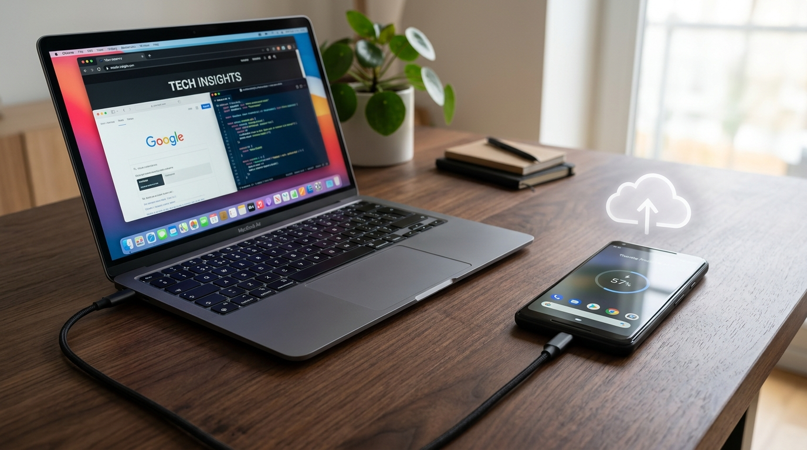
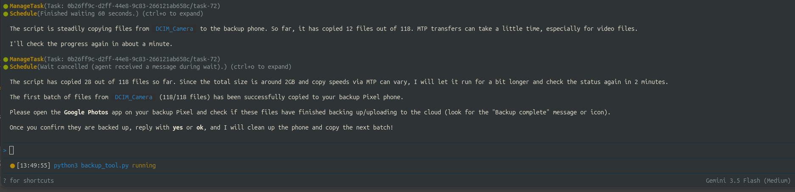

# How I Built a Lifetime Unlimited Google Photos Backup Pipeline for Free (With a $30 Proxy Phone)

### Taming storage limits and USB instability of a 2016 Google Pixel to build the ultimate camera media archiving machine.



We have all felt the pinch of the cloud storage era.

In June 2021, Google officially retired the beloved free tier of Google Photos. Suddenly, millions of users found their photo libraries eating into their 15GB Gmail storage quota. Upgrading to Google One became an inevitable monthly subscription tax.

But what if I told you there is an official, lifetime loophole to this restriction?

A loophole that lets you upload **unlimited** photos and videos at **Original Quality** (raw files, 4K videos, you name it) completely free of charge.

All it takes is a 10-year-old smartphone, a USB cable, and some clever Python automation.

---

## The 2016 Pixel Loophole

When Google launched the original Pixel 1 in 2016, they included a rare marketing promise: **lifetime unlimited backups to Google Photos at Original Quality**. 

Unlike newer Pixel models (which either had their perks expire or restricted to "Storage Saver" quality), the original Pixel’s grant remains active today. Any photo or video uploaded *directly from that device* does not count against your Google Account storage quota.

Naturally, tech enthusiasts realized they could buy a used Pixel 1 on eBay for $30 to $50, transfer their DSLR camera libraries or modern iPhone pictures to it, and upload them. 

But as anyone who has tried this knows: **it’s a physical nightmare.**

---

## The Two Fatal Roadblocks

Using the Pixel 1 as an upload proxy sounds simple, but you will quickly hit two massive roadblocks:

### 1. The Storage Bottleneck
The original Google Pixel is most commonly equipped with **32GB of internal storage**. If you are trying to backup a 500GB camera library or a year's worth of family videos, a simple drag-and-drop will immediately fail due to lack of space.

### 2. Linux MTP Connection Drops
To transfer photos, you connect the phone to your computer via USB in MTP (Media Transfer Protocol) mode. In Linux (via GVFS), MTP is notoriously fragile. If you queue up 10,000 photos, the MTP mount will inevitably hang, timeout, or crash halfway through, leaving your system in an unknown, partially transferred state.

To make this strategy work, we need a system that:
* **Batches** transfers dynamically so we never fill the Pixel's local storage.
* **Throttles** copies so the MTP connection doesn't drop.
* **Verifies** cloud uploads before purging local copies.
* **Resumes** cleanly if anything crashes.

---

## The Solution: A Python-Orchestrated Backup Pipeline

To solve this, I wrote a lightweight CLI pipeline composed of two scripts: `pull_source_media.py` (Ingestion) and `backup_tool.py` (Orchestration).

Here is the terminal interface in action:



---

## Under the Hood: How the Code Works

The pipeline is split into a staging phase and an upload phase to keep operations clean and modular.

### Phase 1: Media Ingestion
First, we ingest photos from our primary capturing phone (e.g., a modern phone) onto our local computer staging directory using `pull_source_media.py`. 

The script scans for USB-attached MTP mounts under Linux (`/run/user/<uid>/gvfs/`), automatically filters out our target Google Pixel, and copies the media files to a local directory:
* It reads files from target directories like `DCIM/Camera` or `WhatsApp Media`.
* It performs a fast file-size check to skip already copied files, making it highly resume-friendly.

```python
# Avoid pulling if file already exists with same size
if os.path.exists(dest_file):
    if os.path.getsize(src_file) == os.path.getsize(dest_file):
        skipped += 1
        continue
```

### Phase 2: Batching and Upload Orchestration
Next, we run `backup_tool.py` to stream files from the local computer staging folder into the Pixel. The script solves the storage limitation using a **virtual batching algorithm**.

Instead of copying everything, the script scans the source files and groups them into logical batches whose cumulative size does not exceed a configurable limit, say, **2000 MB**.

```python
def split_into_batches(file_paths, batch_size_mb):
    max_size_bytes = batch_size_mb * 1024 * 1024
    batches, current_batch = [], []
    current_batch_bytes = 0
    
    for f_path in file_paths:
        f_size = os.path.getsize(f_path)
        if current_batch_bytes + f_size > max_size_bytes:
            batches.append(current_batch)
            current_batch = [f_path]
            current_batch_bytes = f_size
        else:
            current_batch.append(f_path)
            current_batch_bytes += f_size
    if current_batch:
        batches.append(current_batch)
    return batches
```

For each batch, the script executes the following transaction:
1. **Clear Device:** It deletes any leftover files in the Pixel's camera folder to maximize free space.
2. **Transfer:** It copies the files in the batch over USB using `shutil.copyfile` (avoiding copying metadata attributes which crash MTP mounts).
3. **Verify:** It pauses and prompts the user:
   > *"Have you confirmed that files from 'Batch 1' are backed up on Google Photos? (yes/no):"*
4. **Log State:** Once the user types `yes`, the script records the relative file paths in a `.backup_history.txt` log file inside the source folder.
5. **Prune:** It clears the device and proceeds to the next batch.

---

## Why Resiliency is Key

By saving the upload log as **relative paths** inside the source staging folder, the pipeline is extremely resilient. 

If the USB cable is accidentally unplugged, or your computer crashes on Batch 12 out of 50, you don't lose your place. When you run `./backup_tool.py` again, it reads `.backup_history.txt` to populate a set of processed files, matches them, and immediately skips to Batch 12 to pick up where it left off.

```python
# Load already backed up files to skip them
history = load_history(src_root)
files_to_copy = [p for p in files if os.path.relpath(p, src_root) not in history]
```

---

## Running the Pipeline & Driving it with AI Agents

Executing this backup pipeline is simple and fully configurable. First, set up your path environment variables by copying `.env.example` to `.env`.

### 1. Manual Execution
Run the ingestion step to pull new media from your primary phone to your computer's local staging folder:
```bash
./pull_source_media.py
```
Then, connect your original Pixel phone, unlock it, set the USB mode to **File Transfer**, and execute the backup tool:
```bash
./backup_tool.py
```
*(Note: You can override defaults on the fly, e.g., `./backup_tool.py --src /my/custom/path --batch-size-mb 1500`)*

### 2. Driving via AI Coding Agents (Autopilot Mode)
One of the most powerful features of this setup is that it is configured out-of-the-box for AI coding agents. Since MTP transfers and batching are interactive, you can offload the entire backup cycle to an agent.

#### Google Antigravity & Gemini CLI
This workspace features a project-scoped skill (`.agents/skills/pixel-photo-backup/SKILL.md`) that is auto-discovered when you open the repository. You can simply ask the agent:
> *"Back up my media folder to the Pixel"*

The agent will parse the folder layout, run the script, monitor terminal streams, prompt you for verification at each checkpoint, clear the Pixel, and notify you when the entire transfer has successfully finished.

#### Claude Code & General Terminal Agents
For general-purpose developer agents like Claude Code, you can instruct them:
> *"Run the photo backup script"*

The agent will run the command, dynamically check log outputs, and automatically prompt you for verification, handling subprocess communication cleanly.

---

## The Verdict

By spending $30 on a used 2016 Pixel and writing under 300 lines of standard Python code, I created a bulletproof photo archiving system. 

It handles raw DSLR files and high-bitrate video clips without breaking a sweat, bypasses physical storage limits, and avoids the instability of MTP transfers. Best of all, my monthly Google cloud storage bill is officially $0.

Sometimes, the best tech upgrades aren't the newest gadgets, but old hardware paired with a little bit of custom code.

***

*For the complete codebase, configurations, and test files, check out the [GitHub repository](https://github.com/balamuru/pixel-photo-backup).*
